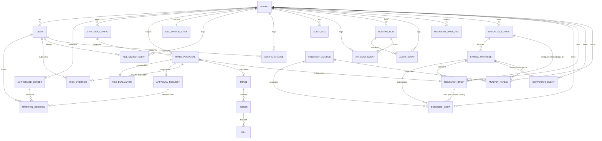

# Data Model — iguanatrader

ERD + entity catalogue + cascade rules for the MVP schema, with v2 multi-tenant Postgres path explicitly preserved (NFR-SC2). Authoritative source for migrations and the SQLAlchemy event listener that rejects queries without `tenant_id` filter (NFR-SC1).

Per [`.ai-playbook/specs/runbook-bmad-openspec.md`](../.ai-playbook/specs/runbook-bmad-openspec.md) §2.1 BMAD artefact requirement.

---

## 1 Cross-cutting rules (apply to ALL tables)

These rules are non-negotiable. The SQLAlchemy event listener in `apps/api/src/iguanatrader/persistence/tenant_listener.py` enforces them at runtime; Alembic migrations are reviewed against them in code review.

### 1.1 Tenant scoping (NFR-SC1, NFR-SC4)

| Rule | Enforcement |
|---|---|
| Every table has `tenant_id UUID NOT NULL` column. | Alembic migration template + drift_check.py custom rule |
| Every table has composite index `(tenant_id, <hot lookup column>)`. | SQLAlchemy `Index()` declaration in `models.py` |
| Every query MUST include `tenant_id = ?` filter. | SQLAlchemy `before_execute` event listener; rejects query and logs `persistence.tenant.filter_missing` |
| Cross-tenant queries return zero results (test `test_cross_tenant_isolation.py`). | Property test asserts isolation invariant per tenant pair |

### 1.2 Identifier strategy

| Concern | Rule |
|---|---|
| Primary key | `id UUID NOT NULL` (UUID v4 stored as `CHAR(36)` in SQLite, `UUID` native in Postgres). Generated in app layer; never auto-increment. |
| Foreign key naming | `<reference>_id` (e.g. `tenant_id`, `proposal_id`). Constraint name `fk_<table>_<column>_<ref>`. |
| Unique constraint name | `uq_<table>_<columns>` |
| Index name | `ix_<table>_<columns>` |
| Check constraint name | `ck_<table>_<rule>` |

### 1.3 Append-only enforcement (FR46-FR48, FR51)

**Append-only tables** (UPDATE / DELETE forbidden — enforced via SQLAlchemy event listener that raises `AppendOnlyViolation`):

`trade_proposals`, `risk_evaluations`, `risk_overrides`, `approval_requests`, `approval_decisions`, `trades`, `orders`, `fills`, `equity_snapshots`, `api_cost_events`, `kill_switch_events`, `config_changes`, `routine_runs`, `alert_events`, `audit_log`, `research_facts` (bitemporal append — see ADR-014), `research_briefs` (versioned immutable), `corporate_events`, `analyst_ratings`.

**Mutable tables** (UPDATE allowed, DELETE forbidden in production except via tenant offboarding job v2):

`tenants`, `users`, `authorized_senders`, `strategy_configs`, `kill_switch_state` (current state derived from events; cached row updateable).

State derivable from append-only events is preferred over mutable rows. Where a mutable row is unavoidable (e.g. `kill_switch_state` for sub-2s read latency), an append-only event log is its source of truth and the mutable row is recomputable.

### 1.4 Timestamps (NFR-O2, ISO 8601 single date format)

| Column | Type | Default | Required |
|---|---|---|---|
| `created_at` | `TIMESTAMP WITH TIME ZONE` (UTC) | `now()` | NOT NULL on all tables |
| `updated_at` | `TIMESTAMP WITH TIME ZONE` (UTC) | `now()` (updated on UPDATE) | NOT NULL on mutable tables only |
| Domain-specific timestamps (e.g. `submitted_at`, `filled_at`, `rejected_at`) | `TIMESTAMP WITH TIME ZONE` (UTC) | NULL until event happens | nullable, set once |

Backend stores UTC, displays in `Europe/Madrid` for Arturo; tests use `freezegun` for determinism.

### 1.5 Money + numeric precision (FR-money rules)

- `Decimal` columns: `NUMERIC(18, 8)` to fit price + size precision (8 decimals covers crypto-precision in v3).
- Currency stored separately as `CHAR(3)` ISO 4217 (`USD`, `EUR`).
- No `FLOAT` / `REAL` types anywhere on money-bearing columns. Drift check in CI grep-rejects them.

### 1.6 Soft delete (deferred to v2)

MVP has no soft-delete column on most tables. v2 multi-tenant offboarding introduces `deleted_at TIMESTAMP NULL` on mutable tables only; queries gain `WHERE deleted_at IS NULL` filter. Append-only tables are never deleted, only orphaned by tenant deletion (handled by v2 tenant-offboarding job per `docs/runbook.md`).

---

## 2 Entity-Relationship Diagram

Cardinality conventions: `||--||` exactly-one, `||--o|` zero-or-one, `||--o{` zero-or-many.

---

## 3 Bounded context catalogue

Tables grouped by their owning bounded context (matches `apps/api/src/iguanatrader/contexts/<context>/` layout; see [docs/architecture-decisions.md](architecture-decisions.md) §Project Structure).

### 3.1 Cross-cutting (`persistence/` + tenant management)

#### `tenants` (mutable; root of tenant hierarchy)

| Column | Type | Constraint | Purpose |
|---|---|---|---|
| `id` | UUID | PK | Tenant identifier (also used as `tenant_id` everywhere) |
| `name` | TEXT | NOT NULL | Human-friendly tenant label |
| `feature_flags` | JSONB / TEXT | NOT NULL DEFAULT '{}' | App-validated allowlist. MVP keys: `hindsight_recall_enabled` (BOOL, default FALSE per FR81). Toggle changes emit `config_changes` row + `audit_log` row. |
| `created_at` | TIMESTAMPTZ | NOT NULL DEFAULT now() | |
| `updated_at` | TIMESTAMPTZ | NOT NULL DEFAULT now() | |
| `deleted_at` | TIMESTAMPTZ | NULL | v2: soft-delete for offboarding |

Indexes: `ix_tenants_deleted_at` (v2).

**Feature flags allowlist** (validated in app code, not DB; rejects unknown keys with `UnknownFeatureFlagError`):
- `hindsight_recall_enabled: bool` — FR81 default FALSE; recommended ON after ≥12 months operation
- (future flags appended here as they emerge)

MVP: single row (Arturo's tenant). v2: many rows; offboarding sets `deleted_at` and triggers async cleanup job.

#### `users` (mutable)

| Column | Type | Constraint | Purpose |
|---|---|---|---|
| `id` | UUID | PK | |
| `tenant_id` | UUID | NOT NULL, FK → `tenants(id)` ON DELETE RESTRICT | |
| `email` | TEXT | NOT NULL | Login identity |
| `password_hash` | TEXT | NOT NULL | Argon2id (NFR-S, current best practice 2026) |
| `role` | TEXT | NOT NULL CHECK (role IN ('admin','user')) | Two-role RBAC per `personas-jtbd.md` |
| `created_at`, `updated_at` | TIMESTAMPTZ | NOT NULL | |

Indexes: `uq_users_tenant_id_email`, `ix_users_tenant_id`.

Cascade: `RESTRICT` on tenant FK so a tenant cannot be deleted while users exist; v2 offboarding job clears users first.

#### `authorized_senders` (mutable)

| Column | Type | Constraint | Purpose |
|---|---|---|---|
| `id` | UUID | PK | |
| `tenant_id` | UUID | NOT NULL, FK → `tenants(id)` ON DELETE RESTRICT | |
| `channel` | TEXT | NOT NULL CHECK (channel IN ('telegram','whatsapp')) | |
| `external_id` | TEXT | NOT NULL | Telegram numeric user ID or E.164 phone number |
| `display_name` | TEXT | NULL | Optional friendly label |
| `enabled` | BOOLEAN | NOT NULL DEFAULT TRUE | Disable without delete |
| `created_at`, `updated_at` | TIMESTAMPTZ | NOT NULL | |

Indexes: `uq_authorized_senders_tenant_id_channel_external_id`.

NFR-S3, NFR-S4: only enabled rows authorize messaging actions.

#### `audit_log` (append-only)

| Column | Type | Constraint | Purpose |
|---|---|---|---|
| `id` | UUID | PK | |
| `tenant_id` | UUID | NOT NULL, FK | |
| `actor_user_id` | UUID | NULL, FK → `users(id)` | NULL for system actions |
| `actor_kind` | TEXT | NOT NULL CHECK (actor_kind IN ('user','system','scheduler','channel')) | |
| `event` | TEXT | NOT NULL | dot-namespaced event (mirrors MessageBus naming) |
| `entity_kind` | TEXT | NULL | e.g. 'trade_proposal' |
| `entity_id` | UUID | NULL | the affected entity |
| `metadata` | JSONB / TEXT | NULL | structured context |
| `created_at` | TIMESTAMPTZ | NOT NULL | |

Indexes: `ix_audit_log_tenant_id_created_at`, `ix_audit_log_entity_kind_entity_id`.

Append-only. Sole authoritative source for `iguana export` audit reports (NFR-O5).

### 3.2 Trading context

#### `strategy_configs` (mutable; FR1-FR5)

| Column | Type | Constraint | Purpose |
|---|---|---|---|
| `id` | UUID | PK | |
| `tenant_id` | UUID | NOT NULL, FK | |
| `strategy_kind` | TEXT | NOT NULL | e.g. `donchian_atr`, `sma_cross` |
| `symbol` | TEXT | NOT NULL | e.g. `SPY` |
| `params` | JSONB / TEXT | NOT NULL | strategy-specific params (lookback, ATR mult, etc.) |
| `enabled` | BOOLEAN | NOT NULL DEFAULT TRUE | per FR2 |
| `version` | INTEGER | NOT NULL DEFAULT 1 | bumps on UPDATE for hot-reload tracking (FR4) |
| `created_at`, `updated_at` | TIMESTAMPTZ | NOT NULL | |

Indexes: `uq_strategy_configs_tenant_id_strategy_kind_symbol`, `ix_strategy_configs_tenant_id_enabled`.

Mutable but every UPDATE triggers a `config_changes` insert for diff history.

#### `trade_proposals` (append-only; FR11)

| Column | Type | Constraint | Purpose |
|---|---|---|---|
| `id` | UUID | PK | |
| `tenant_id` | UUID | NOT NULL, FK | |
| `strategy_config_id` | UUID | NOT NULL, FK → `strategy_configs(id)` ON DELETE RESTRICT | |
| `symbol` | TEXT | NOT NULL | |
| `side` | TEXT | NOT NULL CHECK (side IN ('buy','sell')) | |
| `quantity` | NUMERIC(18,8) | NOT NULL CHECK (quantity > 0) | |
| `entry_price_indicative` | NUMERIC(18,8) | NOT NULL | |
| `stop_price` | NUMERIC(18,8) | NOT NULL | |
| `confidence_score` | NUMERIC(5,4) | NULL CHECK (confidence_score BETWEEN 0 AND 1) | |
| `reasoning` | JSONB / TEXT | NOT NULL | structured: signal source, sizing rationale, stop placement (FR11), inline copy of brief excerpt for self-containment |
| `research_brief_id` | UUID | NULL, FK → `research_briefs(id)` ON DELETE RESTRICT | FR74 — references brief vigente at proposal time; nullable for proposals before research domain is operational |
| `mode` | TEXT | NOT NULL CHECK (mode IN ('paper','live')) | (`backtest` removed 2026-04-28 per Gate A amendment) |
| `correlation_id` | UUID | NOT NULL | request lifecycle linkage |
| `created_at` | TIMESTAMPTZ | NOT NULL | |

Indexes: `ix_trade_proposals_tenant_id_created_at`, `ix_trade_proposals_strategy_config_id`, `ix_trade_proposals_correlation_id`.

#### `trades` (append-only; FR46)

| Column | Type | Constraint | Purpose |
|---|---|---|---|
| `id` | UUID | PK | |
| `tenant_id` | UUID | NOT NULL, FK | |
| `proposal_id` | UUID | NOT NULL, FK → `trade_proposals(id)` ON DELETE RESTRICT | |
| `symbol` | TEXT | NOT NULL | |
| `side` | TEXT | NOT NULL CHECK (side IN ('buy','sell')) | |
| `quantity` | NUMERIC(18,8) | NOT NULL CHECK (quantity > 0) | |
| `mode` | TEXT | NOT NULL CHECK (mode IN ('paper','live')) | (`backtest` removed 2026-04-28 per Gate A amendment) |
| `state` | TEXT | NOT NULL CHECK (state IN ('open','closed_filled','closed_force_exit','closed_canceled')) | append-only? see note |
| `opened_at` | TIMESTAMPTZ | NOT NULL | |
| `closed_at` | TIMESTAMPTZ | NULL | |
| `created_at` | TIMESTAMPTZ | NOT NULL | |

Note: `state` mutates as the trade lifecycle progresses; this is the rare exception to append-only at row level. Justification: queries `WHERE state = 'open'` must be sub-millisecond. The authoritative event log is `audit_log` plus `orders` + `fills`; the `state` column is recomputable from those. SQLAlchemy listener allows UPDATE only on `state` and `closed_at` columns; all other columns are immutable post-INSERT.

Indexes: `ix_trades_tenant_id_state`, `ix_trades_tenant_id_symbol_state`, `ix_trades_proposal_id`.

#### `orders` (append-only; FR14, FR15)

| Column | Type | Constraint | Purpose |
|---|---|---|---|
| `id` | UUID | PK | |
| `tenant_id` | UUID | NOT NULL, FK | |
| `trade_id` | UUID | NOT NULL, FK → `trades(id)` ON DELETE RESTRICT | |
| `broker` | TEXT | NOT NULL CHECK (broker IN ('ibkr','simulated')) | |
| `broker_order_id` | TEXT | NULL | broker-side identifier (set after broker confirm) |
| `order_type` | TEXT | NOT NULL CHECK (order_type IN ('market','limit','stop','stop_limit')) | |
| `side` | TEXT | NOT NULL CHECK (side IN ('buy','sell')) | |
| `quantity` | NUMERIC(18,8) | NOT NULL CHECK (quantity > 0) | |
| `limit_price` | NUMERIC(18,8) | NULL | |
| `stop_price` | NUMERIC(18,8) | NULL | |
| `state` | TEXT | NOT NULL CHECK (state IN ('new','submitted','partially_filled','filled','canceled','rejected')) | |
| `submitted_at` | TIMESTAMPTZ | NULL | |
| `acknowledged_at` | TIMESTAMPTZ | NULL | |
| `closed_at` | TIMESTAMPTZ | NULL | |
| `created_at` | TIMESTAMPTZ | NOT NULL | |

Note: same `state` exception as `trades`. SQLAlchemy listener whitelists state column updates only.

Indexes: `ix_orders_tenant_id_state`, `ix_orders_trade_id`, `uq_orders_tenant_id_broker_broker_order_id`.

#### `fills` (append-only)

| Column | Type | Constraint | Purpose |
|---|---|---|---|
| `id` | UUID | PK | |
| `tenant_id` | UUID | NOT NULL, FK | |
| `order_id` | UUID | NOT NULL, FK → `orders(id)` ON DELETE RESTRICT | |
| `quantity_filled` | NUMERIC(18,8) | NOT NULL CHECK (quantity_filled > 0) | |
| `fill_price` | NUMERIC(18,8) | NOT NULL | |
| `commission` | NUMERIC(18,8) | NOT NULL DEFAULT 0 | |
| `commission_currency` | CHAR(3) | NOT NULL DEFAULT 'USD' | |
| `filled_at` | TIMESTAMPTZ | NOT NULL | broker-reported timestamp |
| `broker_fill_id` | TEXT | NULL | broker-side identifier |
| `created_at` | TIMESTAMPTZ | NOT NULL | system-recorded |

Indexes: `ix_fills_tenant_id_filled_at`, `ix_fills_order_id`.

Multiple fills per order possible (partial fills). Pure append-only.

#### `equity_snapshots` (append-only)

| Column | Type | Constraint | Purpose |
|---|---|---|---|
| `id` | UUID | PK | |
| `tenant_id` | UUID | NOT NULL, FK | |
| `mode` | TEXT | NOT NULL CHECK (mode IN ('paper','live')) | (`backtest` removed 2026-04-28 per Gate A amendment) |
| `account_equity` | NUMERIC(18,8) | NOT NULL | |
| `cash_balance` | NUMERIC(18,8) | NOT NULL | |
| `realized_pnl_today` | NUMERIC(18,8) | NOT NULL DEFAULT 0 | |
| `unrealized_pnl` | NUMERIC(18,8) | NOT NULL DEFAULT 0 | |
| `currency` | CHAR(3) | NOT NULL DEFAULT 'USD' | |
| `snapshot_kind` | TEXT | NOT NULL CHECK (snapshot_kind IN ('tick','minute','hourly','daily','event')) | |
| `created_at` | TIMESTAMPTZ | NOT NULL | |

Indexes: `ix_equity_snapshots_tenant_id_mode_created_at`.

Drives equity curve dashboard + `/sse/equity` push.

### 3.3 Risk context

#### `risk_evaluations` (append-only)

| Column | Type | Constraint | Purpose |
|---|---|---|---|
| `id` | UUID | PK | |
| `tenant_id` | UUID | NOT NULL, FK | |
| `proposal_id` | UUID | NOT NULL, FK → `trade_proposals(id)` ON DELETE RESTRICT | |
| `outcome` | TEXT | NOT NULL CHECK (outcome IN ('allow','reject','clip')) | |
| `cap_type_breached` | TEXT | NULL CHECK (cap_type_breached IN ('per_trade','daily_loss','weekly_loss','max_open','max_drawdown')) | NULL when allow |
| `current_pct` | NUMERIC(8,6) | NULL | observed cap utilisation at evaluation time |
| `state_snapshot` | JSONB / TEXT | NOT NULL | full risk state at evaluation (capital, open positions, daily P&L) |
| `clip_quantity` | NUMERIC(18,8) | NULL | when outcome = 'clip' |
| `created_at` | TIMESTAMPTZ | NOT NULL | |

Indexes: `ix_risk_evaluations_proposal_id`, `ix_risk_evaluations_tenant_id_outcome_created_at`.

Pure-function output (NFR-R6); property-tested in CI.

#### `risk_overrides` (append-only; FR25-FR26)

| Column | Type | Constraint | Purpose |
|---|---|---|---|
| `id` | UUID | PK | |
| `tenant_id` | UUID | NOT NULL, FK | |
| `proposal_id` | UUID | NOT NULL, FK → `trade_proposals(id)` ON DELETE RESTRICT | |
| `risk_evaluation_id` | UUID | NOT NULL, FK → `risk_evaluations(id)` ON DELETE RESTRICT | |
| `authorised_by_user_id` | UUID | NOT NULL, FK → `users(id)` ON DELETE RESTRICT | |
| `reason_text` | TEXT | NOT NULL CHECK (length(reason_text) >= 20) | NFR-S5: minimum 20 chars |
| `confirmation_chain` | JSONB / TEXT | NOT NULL | first/second confirmations + timestamps + channels |
| `state_snapshot_at_override` | JSONB / TEXT | NOT NULL | risk state copied for audit |
| `created_at` | TIMESTAMPTZ | NOT NULL | |

Indexes: `ix_risk_overrides_proposal_id`, `ix_risk_overrides_tenant_id_created_at`.

Critical audit table — surfaces in weekly review + `iguana export risk-overrides` (NFR-O5).

#### `kill_switch_state` (mutable, single row per tenant)

| Column | Type | Constraint | Purpose |
|---|---|---|---|
| `tenant_id` | UUID | PK + FK → `tenants(id)` ON DELETE CASCADE | one-to-one |
| `is_active` | BOOLEAN | NOT NULL DEFAULT FALSE | |
| `last_event_id` | UUID | NULL, FK → `kill_switch_events(id)` | denormalised for sub-2s read (NFR-R5) |
| `updated_at` | TIMESTAMPTZ | NOT NULL DEFAULT now() | |

Recomputable from `kill_switch_events` — this row is a cached materialisation.

#### `kill_switch_events` (append-only; FR29-FR30)

| Column | Type | Constraint | Purpose |
|---|---|---|---|
| `id` | UUID | PK | |
| `tenant_id` | UUID | NOT NULL, FK | |
| `transition` | TEXT | NOT NULL CHECK (transition IN ('activated','deactivated')) | |
| `source` | TEXT | NOT NULL CHECK (source IN ('file_flag','env_var','channel_command','dashboard_button','automatic_backoff','automatic_cap_breach')) | per FR29 |
| `actor_user_id` | UUID | NULL, FK → `users(id)` | NULL for automatic |
| `reason` | TEXT | NULL | required when manual |
| `created_at` | TIMESTAMPTZ | NOT NULL | |

Indexes: `ix_kill_switch_events_tenant_id_created_at`.

Authoritative log; `kill_switch_state.is_active` is a fold of the transitions per tenant.

### 3.4 Approval context

#### `approval_requests` (append-only)

| Column | Type | Constraint | Purpose |
|---|---|---|---|
| `id` | UUID | PK | |
| `tenant_id` | UUID | NOT NULL, FK | |
| `proposal_id` | UUID | NOT NULL, FK → `trade_proposals(id)` ON DELETE RESTRICT | |
| `delivered_to_channels` | JSONB / TEXT | NOT NULL | list of channels fan-out targeted (FR32) |
| `timeout_seconds` | INTEGER | NOT NULL CHECK (timeout_seconds > 0) | per-tenant configurable (FR12) |
| `expires_at` | TIMESTAMPTZ | NOT NULL | created_at + timeout |
| `created_at` | TIMESTAMPTZ | NOT NULL | |

Indexes: `ix_approval_requests_tenant_id_created_at`, `ix_approval_requests_proposal_id`.

#### `approval_decisions` (append-only; FR48)

| Column | Type | Constraint | Purpose |
|---|---|---|---|
| `id` | UUID | PK | |
| `tenant_id` | UUID | NOT NULL, FK | |
| `request_id` | UUID | NOT NULL, FK → `approval_requests(id)` ON DELETE RESTRICT | |
| `outcome` | TEXT | NOT NULL CHECK (outcome IN ('granted','rejected','timeout')) | |
| `decided_via_channel` | TEXT | NOT NULL CHECK (decided_via_channel IN ('telegram','whatsapp','dashboard','timeout','system')) | |
| `decided_by_user_id` | UUID | NULL, FK → `users(id)` ON DELETE RESTRICT | NULL for timeout/system |
| `decided_by_sender_id` | UUID | NULL, FK → `authorized_senders(id)` ON DELETE RESTRICT | populated when channel = telegram/whatsapp |
| `latency_ms` | INTEGER | NOT NULL CHECK (latency_ms >= 0) | request created_at → decision created_at |
| `created_at` | TIMESTAMPTZ | NOT NULL | |

Indexes: `uq_approval_decisions_request_id` (one decisive outcome per request — first to publish wins), `ix_approval_decisions_tenant_id_outcome_created_at`.

### 3.5 Observability context

#### `api_cost_events` (append-only; FR40, NFR-O1)

| Column | Type | Constraint | Purpose |
|---|---|---|---|
| `id` | UUID | PK | |
| `tenant_id` | UUID | NOT NULL, FK | |
| `provider` | TEXT | NOT NULL CHECK (provider IN ('anthropic','perplexity')) | |
| `model` | TEXT | NOT NULL | exact model id (e.g. `claude-opus-4-7`) |
| `node` | TEXT | NOT NULL | logical node: `routine.premarket`, `alert.tier2`, `research.adhoc`, etc. |
| `routine_run_id` | UUID | NULL, FK → `routine_runs(id)` ON DELETE RESTRICT | |
| `proposal_id` | UUID | NULL, FK → `trade_proposals(id)` ON DELETE RESTRICT | when LLM informed a proposal |
| `input_tokens` | INTEGER | NOT NULL CHECK (input_tokens >= 0) | |
| `output_tokens` | INTEGER | NOT NULL CHECK (output_tokens >= 0) | |
| `cache_hit_tokens` | INTEGER | NOT NULL DEFAULT 0 | NFR-I3 prompt-cache observability |
| `usd_cost` | NUMERIC(12,8) | NOT NULL CHECK (usd_cost >= 0) | |
| `latency_ms` | INTEGER | NOT NULL CHECK (latency_ms >= 0) | |
| `prompt_hash` | TEXT | NULL | NFR-O7 reproducibility opt-in |
| `metadata` | JSONB / TEXT | NULL | provider-specific extras (request_id, etc.) |
| `cached` | BOOLEAN | NOT NULL DEFAULT FALSE | TRUE when `replay_cache.py` returned a hit (zero new $$$ spent); FALSE when fresh LLM call. Replaces former `mode` enum (Gate A amendment 2026-04-28 simplified to single-mode-live) |
| `created_at` | TIMESTAMPTZ | NOT NULL | |

Indexes: `ix_api_cost_events_tenant_id_created_at`, `ix_api_cost_events_routine_run_id`, `ix_api_cost_events_provider_model_created_at`, `ix_api_cost_events_cached`.

#### `config_changes` (append-only; FR47)

| Column | Type | Constraint | Purpose |
|---|---|---|---|
| `id` | UUID | PK | |
| `tenant_id` | UUID | NOT NULL, FK | |
| `actor_user_id` | UUID | NULL, FK → `users(id)` | NULL when SIGHUP-driven (NFR-S8) |
| `source` | TEXT | NOT NULL CHECK (source IN ('cli','dashboard','channel_command','sighup','startup')) | |
| `entity_kind` | TEXT | NOT NULL | e.g. `strategy_config`, `risk_caps`, `authorized_sender` |
| `entity_id` | UUID | NULL | nullable when system-wide |
| `diff` | JSONB / TEXT | NOT NULL | before/after JSON patch |
| `created_at` | TIMESTAMPTZ | NOT NULL | |

Indexes: `ix_config_changes_tenant_id_created_at`, `ix_config_changes_entity_kind_entity_id`.

### 3.6 Orchestration context

#### `routine_runs` (append-only; FR43)

| Column | Type | Constraint | Purpose |
|---|---|---|---|
| `id` | UUID | PK | |
| `tenant_id` | UUID | NOT NULL, FK | |
| `routine_kind` | TEXT | NOT NULL CHECK (routine_kind IN ('premarket','midday','postmarket','weekly_review')) | |
| `state` | TEXT | NOT NULL CHECK (state IN ('scheduled','running','succeeded','failed','skipped')) | |
| `scheduled_at` | TIMESTAMPTZ | NOT NULL | |
| `started_at` | TIMESTAMPTZ | NULL | |
| `finished_at` | TIMESTAMPTZ | NULL | |
| `output_path` | TEXT | NULL | path to artefact (PDF, markdown report) |
| `error_message` | TEXT | NULL | on failed |
| `correlation_id` | UUID | NOT NULL | for OTel span linkage |
| `created_at` | TIMESTAMPTZ | NOT NULL | |

Indexes: `ix_routine_runs_tenant_id_routine_kind_scheduled_at`.

State exception same as `trades`/`orders` — narrow whitelist of UPDATE columns (`state`, `started_at`, `finished_at`, `output_path`, `error_message`).

#### `alert_events` (append-only; FR33-FR35)

| Column | Type | Constraint | Purpose |
|---|---|---|---|
| `id` | UUID | PK | |
| `tenant_id` | UUID | NOT NULL, FK | |
| `tier` | INTEGER | NOT NULL CHECK (tier IN (1,2,3)) | |
| `routine_run_id` | UUID | NULL, FK → `routine_runs(id)` ON DELETE RESTRICT | |
| `kind` | TEXT | NOT NULL | tier-specific subkind (e.g. `gap_open`, `news_relevance`, `cap_breach`) |
| `payload` | JSONB / TEXT | NOT NULL | structured alert content |
| `delivered_to_channels` | JSONB / TEXT | NOT NULL | fan-out targets |
| `triggered_at` | TIMESTAMPTZ | NOT NULL | event time (broker timestamp or scheduler tick) |
| `delivered_at` | TIMESTAMPTZ | NULL | first successful delivery |
| `created_at` | TIMESTAMPTZ | NOT NULL | system-recorded |

Indexes: `ix_alert_events_tenant_id_triggered_at`, `ix_alert_events_tenant_id_tier_triggered_at`.

### 3.7 Research & Intelligence context (added 2026-04-28 per Gate A amendment; see ADR-014 for bitemporal design)

> **Bitemporal pattern**: `research_facts` is the cornerstone. Two time axes:
> - **Effective time** (`effective_from`, `effective_to`): when the fact is true in the world (e.g. earnings filed 2024-04-25 for Q1-2024 fiscal period)
> - **Knowledge time** (`recorded_from`, `recorded_to`): when iguanatrader learned this fact (e.g. retrieved from EDGAR on 2024-04-26)
>
> Querying "what did we know about AAPL on 2024-06-15?" = `WHERE effective_from <= '2024-06-15' AND (effective_to IS NULL OR effective_to > '2024-06-15') AND recorded_from <= '2024-06-15' AND (recorded_to IS NULL OR recorded_to > '2024-06-15')`.
>
> Fact revisions: when source publishes a corrected value (e.g. EDGAR 10-K/A amended filing), insert NEW row with new `recorded_from` and update OLD row's `recorded_to` to the same timestamp. Original row preserved for audit.

#### `research_sources` (mutable; FR59-FR67)

Catalogue of source adapters. One row per source_id.

| Column | Type | Constraint | Purpose |
|---|---|---|---|
| `id` | TEXT | PK | source_id slug: `sec_edgar`, `fred`, `finnhub`, `gdelt`, `openfda`, `openinsider`, `openbb_sidecar`, `yfinance_via_openbb`, `finviz`, `wgi`, `vdem`, `ibkr_bars`, `yahoo_bars` |
| `display_name` | TEXT | NOT NULL | "SEC EDGAR Official APIs" |
| `tier` | INTEGER | NOT NULL CHECK (tier IN (1,2,3,4)) | scrape ladder tier (FR77) |
| `pit_class` | TEXT | NOT NULL CHECK (pit_class IN ('A','B','C')) | feature_provider tier (FR75): A native PiT, B snapshot, C bootstrap |
| `enabled` | BOOLEAN | NOT NULL DEFAULT TRUE | |
| `last_health_check_at` | TIMESTAMPTZ | NULL | last success ping |
| `last_error_at` | TIMESTAMPTZ | NULL | most recent failure |
| `metadata` | JSONB / TEXT | NULL | source-specific config (rate limits, base URL overrides, etc.) |
| `created_at`, `updated_at` | TIMESTAMPTZ | NOT NULL | |

Note: `research_sources` is **shared across tenants** (catalogue, not per-tenant data). Therefore exception to global `tenant_id` rule — it has no `tenant_id` column. Cross-tenant query allowed because catalogue is non-sensitive.

#### `symbol_universe` (mutable)

| Column | Type | Constraint | Purpose |
|---|---|---|---|
| `id` | UUID | PK | |
| `tenant_id` | UUID | NOT NULL, FK | |
| `symbol` | TEXT | NOT NULL | e.g. `AAPL` |
| `exchange` | TEXT | NOT NULL | e.g. `NASDAQ`, `NYSE` |
| `sector` | TEXT | NULL | GICS sector |
| `industry` | TEXT | NULL | GICS industry |
| `market_cap_bucket` | TEXT | NULL CHECK (market_cap_bucket IN ('mega','large','mid','small','micro')) | |
| `ipo_date` | DATE | NULL | for filtering |
| `delisted_at` | TIMESTAMPTZ | NULL | NULL = active |
| `created_at`, `updated_at` | TIMESTAMPTZ | NOT NULL | |

Indexes: `uq_symbol_universe_tenant_id_symbol_exchange`, `ix_symbol_universe_tenant_id_sector`.

#### `watchlist_configs` (mutable; FR57, FR58)

One row per (tenant, symbol). Drives ingestion schedule + methodology selection.

| Column | Type | Constraint | Purpose |
|---|---|---|---|
| `id` | UUID | PK | |
| `tenant_id` | UUID | NOT NULL, FK | |
| `symbol_universe_id` | UUID | NOT NULL, FK → `symbol_universe(id)` ON DELETE RESTRICT | |
| `tier` | TEXT | NOT NULL CHECK (tier IN ('primary','secondary')) | FR57: primary = streaming + research-active, secondary = alerts-only |
| `methodology` | TEXT | NOT NULL CHECK (methodology IN ('three_pillar','canslim','magic_formula','qarp','multi_factor')) | FR58 |
| `methodology_params` | JSONB / TEXT | NULL | per-methodology weights/thresholds (multi_factor needs them) |
| `brief_refresh_schedule` | TEXT | NOT NULL CHECK (brief_refresh_schedule IN ('daily','weekly','manual')) | FR72 |
| `brief_refresh_cron` | TEXT | NULL | optional override cron expression |
| `enabled` | BOOLEAN | NOT NULL DEFAULT TRUE | |
| `created_at`, `updated_at` | TIMESTAMPTZ | NOT NULL | |

Indexes: `uq_watchlist_configs_tenant_id_symbol_universe_id`, `ix_watchlist_configs_tenant_id_tier`.

#### `research_facts` (bitemporal append-only; FR68, FR69 — see ADR-014)

| Column | Type | Constraint | Purpose |
|---|---|---|---|
| `id` | UUID | PK | |
| `tenant_id` | UUID | NOT NULL, FK | |
| `source_id` | TEXT | NOT NULL, FK → `research_sources(id)` ON DELETE RESTRICT | FR69 |
| `symbol_universe_id` | UUID | NULL, FK → `symbol_universe(id)` ON DELETE RESTRICT | NULL when fact is sector/macro-only |
| `fact_kind` | TEXT | NOT NULL | enum-like text: `fundamental.eps`, `fundamental.revenue`, `macro.cpi`, `news.headline`, `sentiment.score`, `catalyst.earnings_date`, `analyst.rating`, `insider.transaction`, `esg.aggregate`, `pestel.event`, etc. |
| `value_numeric` | NUMERIC(28,12) | NULL | numeric facts (EPS, ratio, score, ...) |
| `value_text` | TEXT | NULL | text facts (headline, rating "Buy"/"Hold"/"Sell") |
| `value_jsonb` | JSONB / TEXT | NULL | structured facts (insider transaction details, full XBRL row) |
| `unit` | TEXT | NULL | e.g. `USD`, `pct`, `bps`, `count`, `sentiment_polarity` |
| `currency` | CHAR(3) | NULL | when monetary |
| `effective_from` | TIMESTAMPTZ | NOT NULL | when fact is true in world (FR68) |
| `effective_to` | TIMESTAMPTZ | NULL | NULL = still effective; SET when superseded |
| `recorded_from` | TIMESTAMPTZ | NOT NULL | when iguanatrader learned this fact (FR68) |
| `recorded_to` | TIMESTAMPTZ | NULL | NULL = still believed; SET when fact revision arrives |
| `source_url` | TEXT | NOT NULL | FR69 — exact URL of provenance (filing PDF, API endpoint with params, scraped page) |
| `retrieval_method` | TEXT | NOT NULL CHECK (retrieval_method IN ('api','scrape','manual','llm')) | FR69 |
| `retrieved_at` | TIMESTAMPTZ | NOT NULL | UTC ISO 8601 — equals `recorded_from` for first ingestion |
| `raw_payload_path` | TEXT | NULL | filesystem path to raw payload (parquet/JSON) for audit reproducibility |
| `confidence` | NUMERIC(5,4) | NULL CHECK (confidence BETWEEN 0 AND 1) | source-asserted confidence (sentiment scores etc.) |
| `metadata` | JSONB / TEXT | NULL | source-specific extras |
| `created_at` | TIMESTAMPTZ | NOT NULL | system-recorded timestamp |

**Constraints (NFR-O8 + FR69 enforcement)**:
- `CHECK (source_id IS NOT NULL)` — redundant with NOT NULL, kept for explicit intent
- `CHECK (source_url IS NOT NULL AND length(source_url) > 0)`
- `CHECK (retrieval_method IS NOT NULL)`
- `CHECK (retrieved_at IS NOT NULL)`
- `CHECK (effective_from <= COALESCE(effective_to, '9999-12-31'))` — temporal sanity
- `CHECK (recorded_from <= COALESCE(recorded_to, '9999-12-31'))`
- `CHECK (value_numeric IS NOT NULL OR value_text IS NOT NULL OR value_jsonb IS NOT NULL)` — at least one value field

Indexes:
- `ix_research_facts_tenant_id_symbol_universe_id_fact_kind` (hot path: query AAPL fundamentals)
- `ix_research_facts_tenant_id_fact_kind_effective_from` (hot path: query macro at time T)
- `ix_research_facts_tenant_id_recorded_from` (hot path: incremental sync since timestamp)
- `ix_research_facts_source_id` (hot path: count facts per source health-check)

#### `research_briefs` (append-only versioned immutable; FR71, FR73)

| Column | Type | Constraint | Purpose |
|---|---|---|---|
| `id` | UUID | PK | |
| `tenant_id` | UUID | NOT NULL, FK | |
| `symbol_universe_id` | UUID | NOT NULL, FK → `symbol_universe(id)` ON DELETE RESTRICT | |
| `watchlist_config_id` | UUID | NOT NULL, FK → `watchlist_configs(id)` ON DELETE RESTRICT | which methodology applied |
| `version` | INTEGER | NOT NULL CHECK (version >= 1) | monotonically increasing per (tenant, symbol) |
| `methodology` | TEXT | NOT NULL CHECK (methodology IN ('three_pillar','canslim','magic_formula','qarp','multi_factor')) | denormalized for query convenience |
| `thesis_text` | TEXT | NOT NULL | LLM-synthesized thesis paragraph(s) |
| `score_overall` | NUMERIC(5,4) | NULL CHECK (score_overall BETWEEN 0 AND 1) | composite score per methodology (NULL if not applicable) |
| `score_components` | JSONB / TEXT | NULL | per-factor breakdown |
| `citations` | JSONB / TEXT | NOT NULL | array of `{fact_id, claim_excerpt}` — every numeric claim cites a fact (FR70, NFR-O8) |
| `audit_trail` | JSONB / TEXT | NOT NULL | array of calculations: `[{formula, inputs[fact_id+value], steps, output}]` (FR70) |
| `llm_provider` | TEXT | NOT NULL | `anthropic` |
| `llm_model` | TEXT | NOT NULL | exact model id |
| `llm_input_tokens` | INTEGER | NOT NULL CHECK (llm_input_tokens >= 0) | |
| `llm_output_tokens` | INTEGER | NOT NULL CHECK (llm_output_tokens >= 0) | |
| `llm_cache_hit_tokens` | INTEGER | NOT NULL DEFAULT 0 | NFR-I3 |
| `partial` | BOOLEAN | NOT NULL DEFAULT FALSE | TRUE if synthesis hit timeout / source degradation |
| `created_at` | TIMESTAMPTZ | NOT NULL | |

Indexes:
- `uq_research_briefs_tenant_id_symbol_universe_id_version` (uniqueness)
- `ix_research_briefs_tenant_id_symbol_universe_id_created_at` (latest brief lookup: ORDER BY created_at DESC LIMIT 1 → vigent brief)

Append-only — UPDATE/DELETE forbidden. Refresh produces NEW row with `version = max(version) + 1`.

#### `corporate_events` (append-only; FR62)

Earnings releases, ex-dividends, splits, M&A announcements, FDA approvals.

| Column | Type | Constraint | Purpose |
|---|---|---|---|
| `id` | UUID | PK | |
| `tenant_id` | UUID | NOT NULL, FK | |
| `symbol_universe_id` | UUID | NOT NULL, FK → `symbol_universe(id)` ON DELETE RESTRICT | |
| `event_kind` | TEXT | NOT NULL CHECK (event_kind IN ('earnings_release','ex_dividend','split','merger_announcement','fda_approval','spinoff','tender_offer','recall','other')) | |
| `event_date` | DATE | NOT NULL | scheduled or actual date |
| `event_time` | TIMESTAMPTZ | NULL | when known precisely (BMO/AMC for earnings) |
| `payload` | JSONB / TEXT | NOT NULL | event-specific (estimated EPS, dividend amount, split ratio, FDA decision text) |
| `source_id` | TEXT | NOT NULL, FK → `research_sources(id)` ON DELETE RESTRICT | FR69 traceability |
| `source_url` | TEXT | NOT NULL | |
| `retrieved_at` | TIMESTAMPTZ | NOT NULL | |
| `created_at` | TIMESTAMPTZ | NOT NULL | |

Indexes:
- `ix_corporate_events_tenant_id_symbol_universe_id_event_date`
- `ix_corporate_events_tenant_id_event_kind_event_date` (upcoming earnings across watchlist)

#### `analyst_ratings` (append-only; FR64)

| Column | Type | Constraint | Purpose |
|---|---|---|---|
| `id` | UUID | PK | |
| `tenant_id` | UUID | NOT NULL, FK | |
| `symbol_universe_id` | UUID | NOT NULL, FK → `symbol_universe(id)` ON DELETE RESTRICT | |
| `firm_name` | TEXT | NOT NULL | analyst firm |
| `analyst_name` | TEXT | NULL | individual analyst, when known |
| `rating` | TEXT | NOT NULL CHECK (rating IN ('strong_buy','buy','hold','sell','strong_sell','withdrawn')) | |
| `previous_rating` | TEXT | NULL | for upgrade/downgrade detection |
| `price_target` | NUMERIC(18,8) | NULL | |
| `price_target_currency` | CHAR(3) | NULL DEFAULT 'USD' | |
| `published_at` | TIMESTAMPTZ | NOT NULL | when rating was published by firm |
| `source_id` | TEXT | NOT NULL, FK → `research_sources(id)` ON DELETE RESTRICT | yfinance_via_openbb / finnhub / finviz_scrape |
| `source_url` | TEXT | NOT NULL | |
| `retrieved_at` | TIMESTAMPTZ | NOT NULL | |
| `created_at` | TIMESTAMPTZ | NOT NULL | |

Indexes:
- `ix_analyst_ratings_tenant_id_symbol_universe_id_published_at`
- `ix_analyst_ratings_tenant_id_firm_name_published_at`

### 3.8 Hindsight bridge

#### `hindsight_bank_refs` (mutable; FR51)

| Column | Type | Constraint | Purpose |
|---|---|---|---|
| `tenant_id` | UUID | PK + FK → `tenants(id)` ON DELETE CASCADE | one-to-one |
| `bank_id` | TEXT | NOT NULL | Hindsight bank identifier (e.g. `iguanatrader-arturo`) |
| `last_retain_at` | TIMESTAMPTZ | NULL | observability |
| `created_at`, `updated_at` | TIMESTAMPTZ | NOT NULL | |

Just a pointer table; the actual memory is stored in Hindsight (separate system).

---

## 4 Cascade rules summary

| FK | Default | Justification |
|---|---|---|
| `* → tenants(id)` | `ON DELETE RESTRICT` MVP / `CASCADE` v2 (offboarding job) | MVP never deletes tenants. v2 offboarding job orchestrates deletion in dependency order. |
| `* → users(id)` | `ON DELETE RESTRICT` | Audit fields preserve user identity even if user account is removed; v2 may soft-delete users instead of hard delete. |
| `kill_switch_state.tenant_id → tenants(id)` | `ON DELETE CASCADE` | Cached row, recomputable. |
| `hindsight_bank_refs.tenant_id → tenants(id)` | `ON DELETE CASCADE` | Pointer record only. |
| `* → trade_proposals(id)`, `* → trades(id)`, `* → orders(id)`, `* → strategy_configs(id)` | `ON DELETE RESTRICT` | All of these are append-only or near-append-only history; deletion is undefined operation. |
| `* → authorized_senders(id)`, `* → users(id)` from `approval_decisions` | `ON DELETE RESTRICT` | Audit preservation. |
| `* → research_sources(id)`, `* → symbol_universe(id)`, `* → research_briefs(id)`, `* → watchlist_configs(id)` | `ON DELETE RESTRICT` | Research fabric — deletion semantics undefined; soft-disable via `enabled=FALSE` instead. |
| `trade_proposals.research_brief_id → research_briefs(id)` | `ON DELETE RESTRICT` | Audit critical (FR74). Brief that informed a trade must persist as long as the trade does. |

Cascade-on-tenant-delete is intentionally **not** the MVP default. v2 offboarding emits a documented sequence (truncate audit_log? archive? export?) per `docs/runbook.md`.

---

## 5 SQLite → Postgres migration path (NFR-SC2)

Schema portability constraints encoded in `models.py`:

- All types map to both engines: `UUID` (Postgres native / SQLite `CHAR(36)`), `JSONB` (Postgres native / SQLite `TEXT` with JSON1 extension), `NUMERIC(18,8)`, `TIMESTAMP WITH TIME ZONE`.
- No engine-specific functions in queries (no Postgres `tsvector`, no SQLite `JSON_EXTRACT` raw — use SQLAlchemy `Cast()` and JSON helpers).
- Migrations use `SQLAlchemy + Alembic` cross-dialect declarations; no raw `op.execute()` SQL in migrations except for documented data backfills.

v1.5 milestone test: `tests/integration/test_sqlite_to_postgres_migration.py` runs Alembic migration head on Postgres test container, exercises all CRUD flows, asserts identical query results to SQLite reference run.

---

## 6 Indexing strategy summary

Every append-only table has at minimum: `(tenant_id, created_at)` covering most chronological queries.

Domain-specific composite indexes added when query analysis shows hot paths:

| Table | Hot composite |
|---|---|
| `trades` | `(tenant_id, state)` for "current open positions" page |
| `orders` | `(tenant_id, state)` and `(tenant_id, broker, broker_order_id)` for reconciliation (FR16) |
| `risk_evaluations` | `(tenant_id, outcome, created_at)` for "today's rejected proposals" view |
| `api_cost_events` | `(tenant_id, provider, model, created_at)` for cost dashboard breakdown (NFR-O4) |
| `equity_snapshots` | `(tenant_id, mode, created_at)` for SSE equity stream + portfolio history |
| `research_facts` | `(tenant_id, symbol_universe_id, fact_kind)` + `(tenant_id, fact_kind, effective_from)` — bitemporal queries |
| `research_briefs` | `(tenant_id, symbol_universe_id, created_at DESC)` — vigent brief lookup |
| `corporate_events` | `(tenant_id, event_kind, event_date)` — upcoming earnings across watchlist |

CI includes a query plan check: `EXPLAIN QUERY PLAN` for hot queries in `tests/integration/test_query_plans.py` ensures index usage.

---

## 7 Resolved decisions (formerly Open Questions, closed 2026-04-28 alongside Gate A amendment)

#### 7.1 `audit_log` granularity → **scoped, not duplicative**

`audit_log` covers cross-domain user actions and rare/sparse events that lack a dedicated table:
- User login / logout / failed-login attempts
- Manual config changes via dashboard or CLI (also captured in `config_changes`, but `audit_log` records the user intent for the action separately from the diff payload)
- Tenant lifecycle (create, update, soft-delete v2)
- Bypass attempts: kill-switch override attempts, override-without-reason failures, scrape rate-limit violations
- Cross-cutting incidents: gitleaks pre-commit fails, OTel emission failures, license-boundary check fails

Domain events with dedicated tables (kill_switch_events, approval_decisions, config_changes, trade_proposals, fills, etc.) **do NOT** double-write to `audit_log`. `audit_log` is queried for "what did the user do?", not "what did the system process?". CI test asserts no duplication: rows in dedicated tables tagged with same `entity_kind` + `entity_id` SHOULD NOT appear in `audit_log`.

#### 7.2 `equity_snapshots.snapshot_kind` enum → **drop `tick`, keep event + minute + daily**

Final enum: `('event','minute','hourly','daily')` — `tick` removed as unrealistic for MVP scale (5-50 tickers, 1-2 strategies). Rationale: tick-by-tick storage at IBKR streaming rate (~100 ms granularity) generates 36 GB/year per ticker per session; not justified by any FR. Sub-minute granularity available via OTel traces if needed for debugging.

The `CHECK (snapshot_kind IN ('tick','minute','hourly','daily','event'))` should be updated to `CHECK (snapshot_kind IN ('event','minute','hourly','daily'))` in the migration.

#### 7.3 JSONB on SQLite → **JSON1 extension prerequisite + CI verify**

SQLite's JSON1 extension is enabled by default in Python's bundled SQLite ≥3.38 (Python 3.11+). However, distributions vary. Decisions:

1. `getting-started.md` lists `python -c "import sqlite3; conn=sqlite3.connect(':memory:'); conn.execute('SELECT json(1)')"` as a smoke test in prerequisites.
2. CI workflow `ci.yml` runs the smoke test as the first step in the test job; failure → red build with explicit error pointing at OS package upgrade path.
3. v2 Postgres path uses native `JSONB` — drop-in replacement; SQLAlchemy abstracts the dialect difference.
4. Schema declared as `JSON` in SQLAlchemy DDL; engine adapter renders `JSONB` (Postgres) or `TEXT` (SQLite with JSON1 functions for queries).

#### 7.4 `trades.state` authoritative source → **dual storage with audit log as source-of-truth**

Current (proposed) design **confirmed**:
- `trades.state` whitelisted for narrow UPDATE (only `state` and `closed_at`); SQLAlchemy listener allows nothing else
- Every transition emits `audit_log` row with `entity_kind='trade'`, `entity_id=trades.id`, `event='trading.trade.<state_transition>'`, `metadata={old_state, new_state, fill_id?, reconciliation_source?}`
- `trades.state` is a **denormalized cache** for sub-millisecond `WHERE state='open'` queries; `audit_log` is the immutable source-of-truth event log
- CI integration test `test_trades_state_audit_consistency.py` walks every trade, replays its `audit_log` events, and asserts the resulting state equals `trades.state`. Drift → CI failure.

This duplicates information by design — the cost is minimal (one row per transition, ~5-50/day MVP scale), the benefit is operational (fast queries) and audit (event log preserved). Not a violation of append-only spirit because the source-of-truth IS append-only.

---

## 7b Resolved decisions (research domain open questions, closed 2026-04-28 alongside Gate B)

#### 7b.1 Bitemporal fact revisions retention → **SQL forever + Hindsight complementary narrative layer**

Confirmed: `research_facts` is **append-only forever in SQL** (no archive policy MVP/v2). Storage despreciable (~10 MB/año/tenant). Archive policy es decisión v3+ cuando storage cost emerja real.

**Hindsight bank `iguanatrader-research-<tenant_id>` añadido como capa narrativa complementaria**, NO archive (FR80, FR81):

| Capa | Default MVP | User toggle | Propósito |
|---|---|---|---|
| **SQL `research_facts`** (forever) | always-on | no toggle | Source of truth structured: provenance, exact values, bitemporal queries, citations from briefs |
| **SQL `research_briefs`** (forever, versioned) | always-on | no toggle | Brief vigent + history versionada para trade audit |
| **Hindsight write** (kind: brief_summary, trade_retrospective, pattern_observation) | always-on | no toggle | Build narrative history desde día 1 para que recall valga la pena después de ≥12 meses |
| **Hindsight read** (recall in brief synthesis) | OFF | toggle UI per-tenant | Por debajo de 12 meses recall añade ruido; user activa cuando aporta valor |

Razón: Hindsight es semantic memory, no estructural. NO puede reemplazar SQL bitemporal sin romper citation chain (NFR-O8) + bitemporal queries + audit reproducibility. Las dos capas operan en niveles distintos.

#### 7b.2 `research_facts.value_*` polymorphism → **Option A: 3 nullable columns**

Confirmed: `value_numeric`, `value_text`, `value_jsonb` con `CHECK (value_numeric IS NOT NULL OR value_text IS NOT NULL OR value_jsonb IS NOT NULL)`. Razón: query ergonomics nativos para "AAPL P/E entre 15-25" + numeric index para range queries. El "anti-normal sin" de 3 nullable columns es small price para 10× speedup en queries comunes.

#### 7b.3 `raw_payload_path` filesystem dependency → **Option C: hybrid 16 KB threshold**

Confirmed:
- Small payloads (<16 KB): inline JSONB en column `raw_payload_inline`
- Large payloads (≥16 KB): filesystem en `data/research_cache/<source_id>/<yyyy-mm>/<sha256>.<ext>` con `raw_payload_path` apuntando + sha256 en metadata
- CHECK constraint: `(raw_payload_inline IS NOT NULL) <> (raw_payload_path IS NOT NULL)` (XOR, exactly-one-set)
- Monthly integrity check job: verifica `sha256(file_at_path) == metadata.sha256` para todos filesystem-tier facts; broken hash → log + alert + flag fact `provenance_compromised=true`

#### 7b.4 Cross-tenant fact sharing for SaaS v2 → **Option A: per-tenant MVP, ADR-018 v2**

Confirmed: per-tenant en MVP por simplicidad (Arturo single-tenant). Cuando v2 SaaS emerja con ≥10 tenants y storage cost >1 GB tenant-shared duplicate, abrimos ADR-018 dedicado para evaluar global vs per-tenant fact tables. Decisión deferrida es la decisión correcta — premature optimization desde día 1 introduce complexity sin payoff visible en MVP.

---

## 7c Schema additions resulting from §7b decisions

#### `research_facts` updated columns (per §7b.3 hybrid)

Replace columna `raw_payload_path` única con:

| Column | Type | Constraint | Purpose |
|---|---|---|---|
| `raw_payload_inline` | JSONB / TEXT | NULL | hybrid: payloads < 16 KB stored inline |
| `raw_payload_path` | TEXT | NULL | hybrid: payloads ≥ 16 KB stored on filesystem `data/research_cache/<source_id>/<yyyy-mm>/<sha256>.<ext>` |
| `raw_payload_sha256` | CHAR(64) | NULL | sha256 hex of payload for integrity check |
| `raw_payload_size_bytes` | INTEGER | NULL CHECK (raw_payload_size_bytes >= 0) | for tier decisioning + analytics |

CHECK constraints:
- `CHECK ((raw_payload_inline IS NULL) <> (raw_payload_path IS NULL))` — XOR exactly one
- `CHECK (raw_payload_path IS NULL OR raw_payload_sha256 IS NOT NULL)` — sha256 mandatory when filesystem
- `CHECK (raw_payload_size_bytes IS NULL OR raw_payload_size_bytes < 16384 OR raw_payload_path IS NOT NULL)` — size > 16 KB must use filesystem

---

## 8 Cross-references

- [docs/architecture-decisions.md](architecture-decisions.md) §Project Structure — file layout where each repository lives.
- [docs/architecture-decisions.md](architecture-decisions.md) §Authentication & Security — `tenant_id` propagation chain.
- [docs/prd.md](prd.md) FR46-FR51 — append-only + multi-tenant requirements.
- [docs/personas-jtbd.md](personas-jtbd.md) §RBAC Matrix — `admin` / `user` roles drive `users.role` constraint.
- [.ai-playbook/specs/runbook-bmad-openspec.md](../.ai-playbook/specs/runbook-bmad-openspec.md) §2.1 — artefact requirement.
