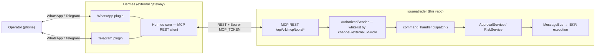
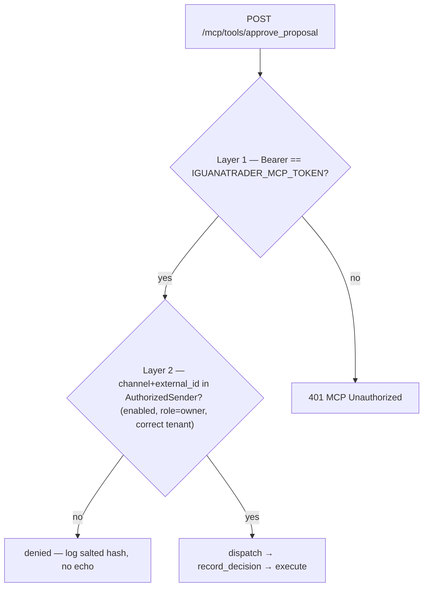
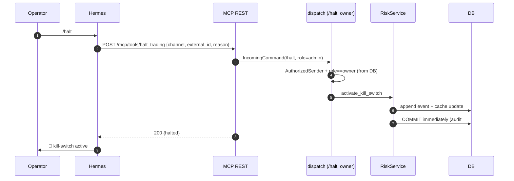

## Context

The operator wants a hands-off, messaging-driven workflow: iguanatrader contacts them on WhatsApp/Telegram and they approve or halt from the phone — never the CLI or dashboard. The chosen topology routes **both** channels through **Hermes** (an external gateway that already owns the WhatsApp + Telegram plugins). Hermes is an **MCP REST client** of iguanatrader; iguanatrader never registers against Meta/Telegram.

Today the loop cannot close. Three independent gaps:

1. The MCP surface **deliberately excludes** approve/reject ([mcp.py:38-46](../../../apps/api/src/iguanatrader/api/routes/mcp.py#L38-L46)), citing "the human-in-the-loop trust boundary is the approval-channels fanout (P1)".
2. The native channel transports are stubs (only `Fake*Transport` exist; `start_listening` never runs in the daemon), so there is no real inbound wire.
3. The outbound notification is sparse — `build_outbound_message_from_request` ([dispatcher.py:123-134](../../../apps/api/src/iguanatrader/contexts/approval/dispatcher.py#L123-L134)) sends only `proposal_id` + `expires_at`, with no symbol/side/qty/stop for the operator to decide on.

The audit (PR #283, merged) already hardened the **shared dispatch core** this change reuses: tenant-keyed idempotency (#39), `ApprovalExpiredError` on late decisions (#30), the `/lock` pause gate + `set_feature_flag` writer (#31), and durable kill-switch commit (#27). So the enforcement is sound; what is missing is a **transport** that feeds it the operator's verified identity.

**Constraint that drives the whole design:** `command_handler.dispatch()` ([command_handler.py:145-231](../../../apps/api/src/iguanatrader/contexts/approval/channels/command_handler.py#L145-L231)) **trusts** `IncomingCommand.role` and `IncomingCommand.tenant_id` — the whitelist/role/tenant resolution happens **at the channel adapter boundary, before dispatch**. Therefore the new MCP path is a *channel adapter*, and the entire HITL trust boundary lives in how that adapter resolves `AuthorizedSender` and `role` from the database.

## Diagrams

### Topology — who talks to whom

iguanatrader never touches Meta/Telegram — Hermes owns those plugins; iguanatrader only exposes MCP REST.

### Two-layer trust model (the linchpin)

Layer 1 (the service token) alone NEVER authorises a money action. Layer 2 (operator identity, DB-resolved) is what restores the HITL boundary the original exclusion comment protected.

### Kill-switch over the channel must be durable (audit #27)

## Goals / Non-Goals

**Goals:**
- Expose HITL **action** tools on the existing MCP REST surface (`/api/v1/mcp/tools/*`): `approve_proposal`, `reject_proposal`, `halt_trading`, `resume_trading`, `lock`, `unlock`, plus read tool `list_pending_approvals`.
- Preserve the HITL trust boundary by **revalidating the operator's `channel`+`external_id` against `AuthorizedSender` on every action** — the MCP service bearer token alone NEVER authorises a money action.
- Resolve the privileged role **from the database** (a new `authorized_senders.role` column), never from the request payload — fulfilling the deferred "slice O1 follow-up" noted in [types.py:76-77](../../../apps/api/src/iguanatrader/contexts/approval/channels/types.py#L76-L77).
- Reuse `command_handler.dispatch()` verbatim — zero duplicated approval/kill-switch/idempotency/pause logic.
- Enrich the outbound approval push (symbol/side/qty/entry/stop/expiry) and add a **second push on execution** (`OrderFilled`) so the operator is notified "until executed".

**Non-Goals:**
- Building the stubbed native Telegram/WhatsApp transports (`start_listening`, real wire clients) — out of scope; Hermes is the transport.
- MCP JSON-RPC framing — the operator confirmed Hermes consumes the bespoke REST surface; JSON-RPC stays a separate roadmap item.
- Changing the JWT/dashboard approval path or the read-only MCP routes.
- Exposing `place_order` or any pre-approval order construction over MCP.

## Decisions

### D1 — The MCP action route is a channel adapter; the trust boundary is `AuthorizedSender` revalidation
Each action handler takes `channel` + `external_id` (supplied by Hermes, which knows the verified WhatsApp/Telegram sender), looks up an **enabled** `authorized_senders` row for `(tenant_id, channel, external_id)`, and only then builds an `IncomingCommand` and calls `dispatch()`. No row → denied, no execution, no echo of proposal details (log the sender by hash).
- **Why:** `dispatch()` trusts `incoming.role`/`tenant_id`; if the MCP route skipped the whitelist, the service bearer token would become a single-factor money key — exactly the risk the original exclusion comment guarded against. Revalidation restores the two-layer model (service token = Layer 1; operator identity = Layer 2, the linchpin).
- **Alternative considered:** trust Hermes to have already authorised the sender and accept the service token alone. Rejected — collapses HITL to one factor and trusts an external service with money actions.

### D2 — Privileged role resolved from a new `authorized_senders.role` column (owner→admin)
Add `role TEXT NOT NULL DEFAULT 'user'` with `CHECK (role IN ('user','owner'))` to `authorized_senders`. The MCP adapter maps `owner → IncomingCommand.role="admin"`, `user → "user"`. Privileged commands (`/halt`, `/resume`, `/override`, `/lock`, `/unlock`) already require `required_role="admin"` ([halt.py:50](../../../apps/api/src/iguanatrader/contexts/approval/channels/commands/halt.py#L50) et al.), so the existing gate enforces "owner-only" with no dispatch change.
- **Why "owner" terminology, "admin" gate:** the operator asked for an *owner per tenant responsible for its operations*, elevated **from DB** (not the dashboard-JWT admin). The code's privilege literal is `admin`; we keep that gate and map the domain term `owner` onto it at the adapter — honouring the operator's model without forking `RequiredRole`.
- **Alternative considered:** add a third `owner` literal to `RequiredRole` and re-gate every command. Rejected — churns the whole command registry for a synonym; the mapping is cleaner and reversible.

### D3 — Every MCP action tool requires the tenant owner (Gate E: "owner siempre")
All action tools — `approve_proposal`, `reject_proposal`, `halt_trading`, `resume_trading`, `lock`, `unlock` — require `role='owner'`. The owner gate is enforced **at the MCP adapter** as a precondition on the whole action surface, so the shared command registry is untouched and the dashboard/Telegram-native paths keep their own per-command role policy. For the single-operator MVP the operator *is* the owner and the only actor; a whitelisted `user` row can still be reached by future read/status tools but cannot invoke any action tool.
- **Why adapter-level, not flipping `/approve`'s `required_role` to admin:** changing the command registry would also force admin on the dashboard/Telegram-native approve paths. Gating at the MCP route keeps the change MCP-scoped and reversible.
- **Alternative considered:** keep the routine/owner split (approve open to any `user`). Rejected per the operator's Gate E answer — single operator, single owner, everything owner-gated.

### D4 — Idempotency = pass Hermes's callback id through, on top of the tenant-keyed window
The action payload carries Hermes's interactive/callback id as `IncomingCommand.idempotency_key`; the dispatcher's `#39` tenant-keyed cache (request_id for approve/reject; 30s payload bucket for halt/lock) does the dedup. Double-tap or Hermes retry ⇒ one execution. *"No queremos cagadas."*

### D5 — Enriched notification + second push, both via the existing Hermes adapter
Enrich `build_outbound_message_from_request` to load the `TradeProposal` and render symbol/side/qty/entry/stop/expiry. Subscribe **two** handlers (Gate E OQ3 = execution + close-out): `OrderFilled` → an execution-confirmation push (`✅ ejecutado: …`), and `TradeClosed` → a close-out push with realized P&L (`🔚 … cerrado: +$X / +Y%`), both to the proposal's authorised senders. Reuse `HermesWhatsAppMessageDispatcher.send(address, body)` ([hermes.py:48-61](../../../apps/api/src/iguanatrader/shared/channel_dispatch/adapters/hermes.py#L48-L61)) — no new outbound client.

### D6 — Tool shape mirrors the existing MCP action tools exactly
New endpoints reuse the `mcp_tools.py` pattern: `extra="forbid"` pydantic request/response, `@router.post(..., dependencies=[Depends(_bearer_auth), Depends(_bind_tenant_context)])`, registry entry in `_TOOL_SPECS`. No new auth machinery.

## Risks / Trade-offs

- **[The service bearer token leaks]** → Layer 2 (`AuthorizedSender` revalidation) means a leaked token still cannot move money without a whitelisted operator identity; halt/lock additionally require `owner`. Token stays in SOPS; `gitleaks` gates commits.
- **[Hermes is compromised and forges `external_id`]** → it can only act as senders already whitelisted *and enabled* for that tenant; it cannot self-elevate to `owner` (role is DB-resolved, payload role ignored). Residual: Hermes can replay an authorised sender's approve. Mitigated by idempotency + expiry (#30) + the operator seeing the second push and being able to `/halt`. Documented as accepted for single-operator MVP.
- **[`role` defaults to `user` on migration]** → existing seeded senders lose privileged ops until an `owner` row is set. Intended fail-safe (deny-by-default); the deploy step seeds the operator as `owner` explicitly.
- **[Enrichment loads the proposal on every notification]** → one extra `db.get(TradeProposal, ...)` per approval push; negligible, and the data is already in-session at request time.
- **[Second push depends on `OrderFilled` firing]** → if execution silently fails upstream, no second push. Acceptable: the absence of a "filled" message is itself a signal, and `/status` remains available.

## Migration Plan

1. **Schema:** new migration adds `authorized_senders.role` (`NOT NULL DEFAULT 'user'`, `CHECK IN ('user','owner')`). Forward-only; downgrade drops the column. Backfill: existing rows → `user` (deny-by-default).
2. **Code:** additive MCP routes + DTOs; adapter resolver; notification enrichment; `OrderFilled` subscriber; docstring reversal of the exclusion comment.
3. **Config (no secrets in repo):** set `IGUANATRADER_MCP_TOKEN`, `IGUANATRADER_MCP_TENANT_SLUG`, `HERMES_BASE_URL`, `HERMES_HMAC_SECRET` via SOPS; seed one `authorized_senders` row (operator's number/chat id, `role='owner'`, `enabled=true`).
4. **Rollback:** routes are additive — disable by unsetting `IGUANATRADER_MCP_TOKEN` (surface returns 503) and `git revert`; run the migration downgrade. No data loss (column is additive).

## Open Questions

Resolved at Gate E (2026-06-03):
- **OQ1 → Telegram first.** Telegram closes the loop fastest; seed the operator's Telegram chat id as the first `authorized_senders` row (`role='owner'`). WhatsApp is a later seed via the same code path (just another `channel` value).
- **OQ2 → Owner always.** Every MCP action tool requires `owner` (see D3); the routine/owner split is collapsed for the single-operator MVP.
- **OQ3 → Execution + close-out.** Two pushes: `OrderFilled` ([events.py:191](../../../apps/api/src/iguanatrader/contexts/trading/events.py#L191)) = execution confirmed, and `TradeClosed` ([events.py:319](../../../apps/api/src/iguanatrader/contexts/trading/events.py#L319)) = close-out with realized P&L (see D5).

None outstanding.
